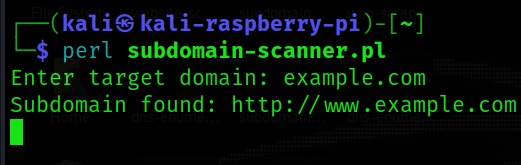

<h1><b>Subdomain Finder</b></h1>
<h2><i>A Software To Scan All The Subdomain Of Target Website.</h1></i>

#
  </a>

#
<h2><b> 😇 Author: Sumalya Chatterjee </b></h2>

#
<h1><b>❤️ If you fork, you are cute 😊</b></h1>

#

<h1><b>Result 👇</b></h1>



#

<h1><b>Git Installation </h1></b>

```
# Install Git
sudo apt install git

# Install Perl
sudo apt install perl

# Git Clone
git clone https://github.com/R3DHULK/subdomain-finder-in-perl

# Change Directory
cd subdomain-finder-in-perl

# To Run This Tool
perl subdomain-scanner.pl

```

#
<h2><b><i> Show Support 👇👇👇</b></i> </h2>
<a href="https://www.buymeacoffee.com/r3dhulk"> </a><br><br>
